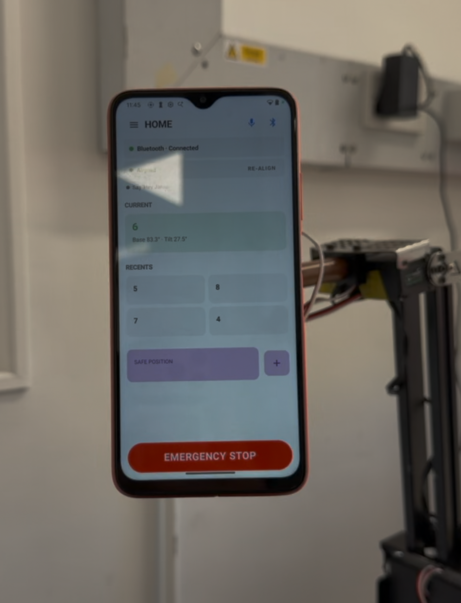
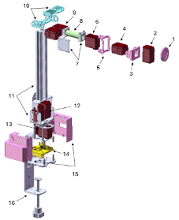
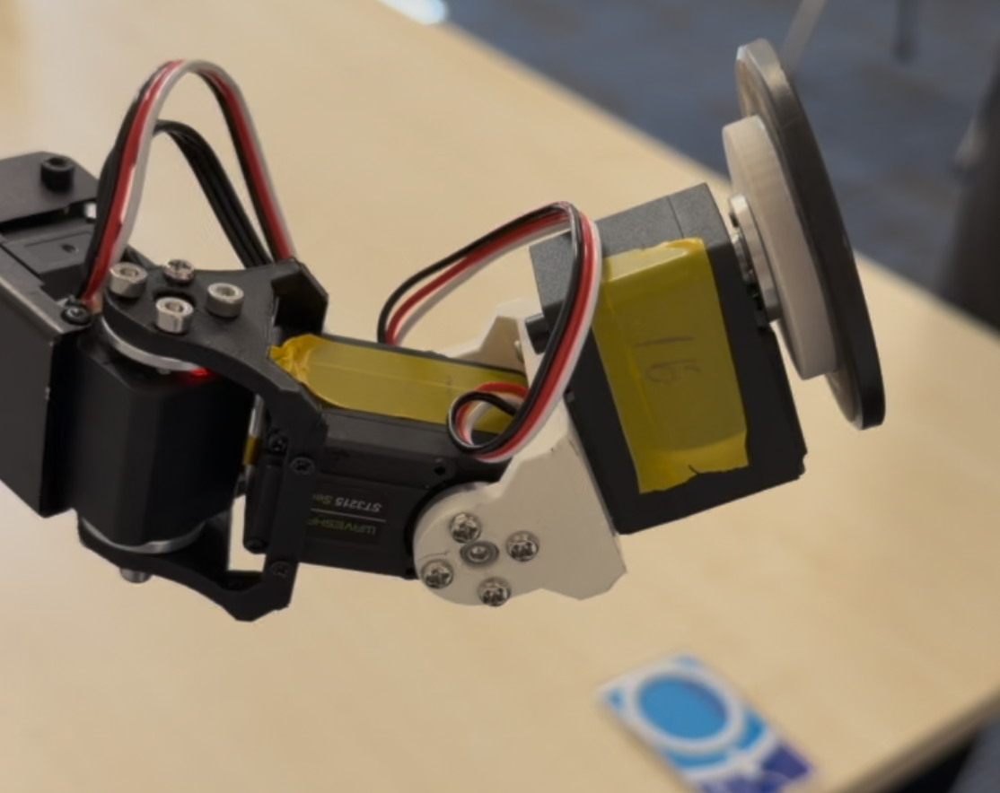
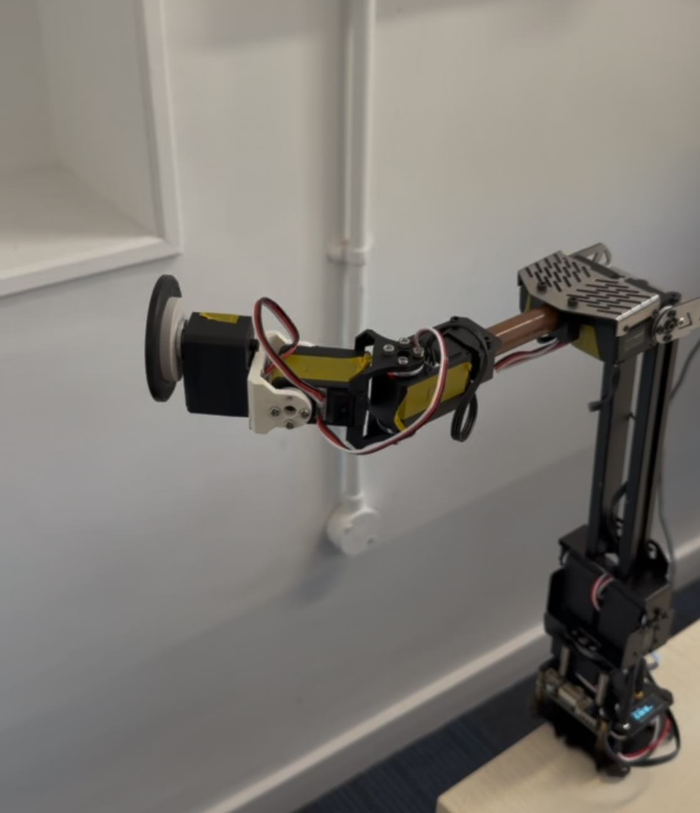
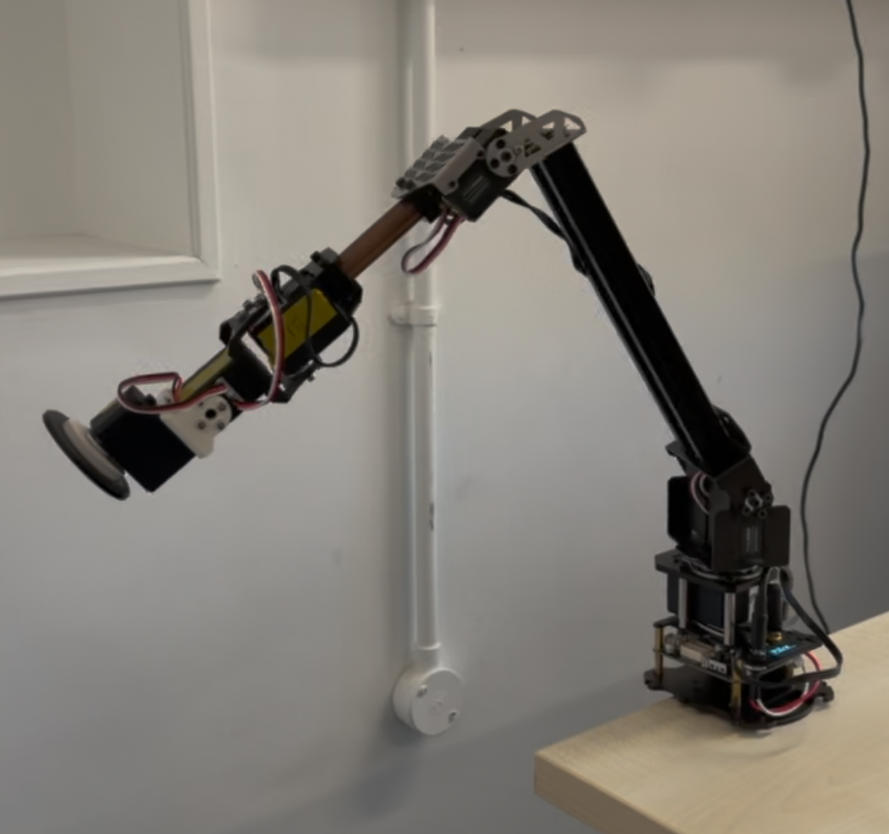

[](README.md) [](README.zh.md)

# A.D.A.P.T.

**App Driven Assistive Positioning Tool** — 一款面向上肢功能障碍用户的、可安装在轮椅上的机械臂手机摆位系统。

<p align="center">
  
</p>

> 一台 6 自由度机械臂：照护者通过物理拖动机械臂记录手机位置，终端用户随后通过语音或触摸即可免手动地调用这些位置——为颈段脊髓损伤患者重建独立使用智能手机的能力。

University College London · MSc Rehabilitation Engineering and Assistive Technologies · 2026 年 4 月

---

## 项目背景

全球范围内有超过 **1500 万脊髓损伤（SCI）患者**，仅英国每年新增 **4,700 例**。颈段 SCI 患者通常会失去全部上肢运动功能，使日常的智能手机交互——通讯、环境控制、社交参与——在没有他人协助的情况下几乎无法完成。研究显示，高位颈段 SCI 患者的智能手机持有率比低位或非 SCI 人群低 *65 %*，尽管移动设备已成为生活质量（QoL）的核心决定因素之一。

现有的手机支架要么是 5 英镑级别的刚性静态底座（每次重新摆位都需健全人协助），要么是上万英镑的工业级机械臂方案。ADAPT 填补了这一空白：以低于 1000 英镑的成本，基于开源的 Waveshare RoArm-M2-S，叠加一个自研的三轴手机末端模块和一套 Android 教学—回放（teach-and-recall）应用。

**研究问题**：*免手动操作的轮椅安装机械臂，能在多大程度上替代当前的静态手机支架，应用于日常生活？*

---

## 核心功能

- **Set / Recall 双模式交互** — 照护者将机械臂物理拖动到目标位置（伺服处于低扭矩模式），命名后保存；终端用户随后可通过语音或主屏的位置卡片重新调用任何已保存姿态。
- **三层并行语音架构**
  - 唤醒词监听层（`openWakeWord`，本地推理），监听唤醒词 *"Hey Jarvis"*
  - 独立的紧急停止持续识别层（`Vosk`，本地推理）——不被其他任务阻塞，*"Stop"* 永远具有最高优先级
  - 命令识别层（Android `SpeechRecognizer`）处理动作指令
- **ISO 13482 §6.2.2 Category 2 紧急停止** — 受控停止 + 保留保持扭矩，避免在人机近距离接触时机械臂因失力而坍塌砸到用户。两条冗余触发路径（UI 红色按钮 + 语音持续识别层），统一通过单一 handler 清理 timers / 进行中的识别 / TTS / 唤醒服务，再发送 `T:0`。
- **TTS 发声确认机制** — 每条识别到的命令都会先用 TTS 发声询问 *"Yes?"* 再执行，将"识别错误"的代价从"一次非预期动作"降低为"一次重复发声"。
- **统一的 T-code JSON 协议** — 同一份固件在 USB serial（开发期）和 Bluetooth SPP（部署期）下使用同一个消息处理器。语音命令、触摸交互、外部脚本生成的 T-code 是同一种线协议格式。
- **6 自由度运动学** — 3 个位置自由度（base、shoulder、elbow）+ 3 个姿态自由度（roll、pitch、yaw，分布在末端三轴模块）。原 RoArm 的 wrist pitch 因与新增姿态链冗余而被移除，shoulder 支撑结构则因末端力矩增大而做了加强。
- **关节空间安全限位（写在固件中）** — 每颗伺服都有角度边界（如 ID15 夹爪 55°–223°，phone-tilt 284°–360°/0°–106° 以避开机械碰撞禁区），任何 T-code 在执行前都会先经过限位过滤。
- **本地优先的位置存储** — 命名姿态以 JSON 格式由 Gson 序列化后写入 Android `SharedPreferences`，无数据库、无网络、无云端遥测。

---

## 硬件

<p align="center">
  
  
</p>

| 部件 | 规格 |
|---|---|
| 基础机械臂 | Waveshare RoArm-M2-S（ESP32 控制器 + ST3215 伺服） |
| 新增自由度 | 3 颗 ST3215 伺服，组成自研三轴（roll / pitch / yaw）手机末端模块 |
| 手机 | Redmi Note 9T（代表机型；任何 Android ≥ 8.0 均可） |
| 结构件 | 铝合金主柱、PLA 3D 打印关节、铜管小臂 |
| 安装方式 | 桌面钢制夹具（RoArm 原厂） |
| 电源 | 12 V DC · 平均 4.9 W · 峰值 8 W |

原 RoArm 的 4 自由度链（base、shoulder、elbow、wrist pitch）经过重构：移除 wrist pitch 后形成一条 3-DoF 到达链，并在末端加装一个三轴姿态模块，提供 roll / pitch / yaw 三个独立姿态自由度。由于末端配重显著增大，肩部支撑做了结构加强。同时将 elbow 到 end-effector 的连杆替换为更短的铜管，缩短力矩臂、降低上游伺服功耗。

<p align="center">
  
</p>

---

## 软件

软件栈由 Android 应用（Kotlin + Jetpack Compose，`minSdk 26`）和 ESP32 固件（Arduino + SCServo 库）组成。两者通过统一的应用层协议通信，USB serial 与 Bluetooth SPP 行为完全一致。

<p align="center">
  
</p>

### 语音命令对照表

| 命令 | 识别层 | 动作 | T-code |
|---|---|---|---|
| Hey Jarvis | 唤醒词（openWakeWord） | 激活机械臂 | – |
| Stop | E-stop（Vosk 持续识别） | 立即停止所有运动 | `T:0` |
| Resume Control | E-stop（Vosk 持续识别） | 解除 E-stop，恢复控制 | `T:999` |
| Move to Position *X* | 命令识别（Android SR） | 调用预设位置 | `T:102` |
| Adjust left / right / up / down | 命令识别（Android SR） | 增量微调 | `T:102` |
| Landscape / Portrait | 命令识别（Android SR） | 切换横竖屏方向 | `T:701` |
| Align | 命令识别（Android SR） | 自动调平手机 | `T:100` / `T:700` |

### 仓库结构

```
ADAPTApp/                         Android 应用（Kotlin + Compose）
└── app/src/main/java/com/example/adaptapp/
    ├── connection/               USB serial + Bluetooth SPP 管理器
    ├── controller/               ArmController、AutoLevel、StepAdjustment
    ├── voice/                    唤醒词、Vosk e-stop、命令处理器
    ├── kinematics/               逆运动学求解器
    ├── repository/               PositionRepository（Gson + SharedPreferences）
    └── ui/screen/                Home、Positions、Setup、Debug 屏幕

RoArm-M2_example/                 ESP32 固件（Arduino）
├── RoArm-M2_example.ino          主入口
├── json_cmd.h                    T-code 派发表
├── RoArm-M2_module.h             IK、关节限位、紧急停止序列
├── RoArm-M2_config.h             关节限位、伺服 ID、IK 常量
├── uart_ctrl.h                   T-code 解析 + 紧急停止门控
├── servo_id_changer/             ID15 夹爪限位测试 sketch
└── Servoinitial/                 双 tilt 伺服同步测试

roarm_position_tool_4.py          Python 位置调试工具
```

---

## 编译与运行

### 固件（Arduino）

1. 安装 Arduino IDE 2.x，并安装 ESP32 开发板支持包。
2. 安装 RoArm-M2-S 附带的 `SCServo` 库。
3. 打开 `RoArm-M2_example/RoArm-M2_example.ino`。
4. 开发板选择 **ESP32 Dev Module**，通过 USB-C 上传到 RoArm 控制器。

### Android 应用

1. 用 Android Studio（Hedgehog 或更新版本）打开 `ADAPTApp/` 目录。
2. 编译 `app` 模块——Gradle 会自动解析 Vosk 与 ONNX Runtime 依赖。仓库中已配置 `aaptOptions { noCompress("onnx") }`，确保唤醒词 ONNX 模型在运行时能正常加载。
3. 安装到带麦克风和蓝牙的手机上（目标机型 Redmi Note 9T，或任意 Android ≥ 8.0）。首次启动前需在系统**设置 → 语言和输入法 → 语音输入 → 离线语言包**中下载英文离线语音包，否则命令识别层会回退到联网模式。
4. 将手机与 RoArm-M2-S 的蓝牙模块配对，*或*用 USB-C OTG 连接。两种链路下协议完全一致。

---

## 验证亮点

| 方法 | 结果 |
|---|---|
| 有限元分析（ANSYS Mechanical 2020 R2 · 完全伸展 · 300 g 末端载荷 · SOLID185 · 81 046 节点） | 最大变形 **1.054 mm** · 关节处最大 von-Mises 应力 **22.53 MPa** · 安全系数 **2.66** |
| 动作捕捉重复性测试（OptiTrack · 17 摄像头 · 120 Hz · 5 个目标点 × 20 次迭代，ISO 9283:1998） | 平均位置重复精度 RP **3.20 mm**（SD 0.92 mm） · 平均姿态重复精度 RO **1.28°** |
| 功耗分析（TP-Link Tapo P110 智能插座 · 4.7 h 连续运行） | 平均 **4.9 W** · 峰值 **8 W** · 50 Wh 电池预计可支持 ≈ **10 h** |
| 混合方法可用性研究（5 名参与者：2 名健康人、2 名 SCI 患者、1 名照护者 · 每场 90 分钟 · 3 个循环） | 召回任务完成时间在 3 个循环间单调下降；用户对设备有用性的评价随上肢功能障碍程度加重而提高 |

---

## 局限与未来工作

- **单一物理急停。** 当前急停仅依赖语音 + 屏幕按钮；为重度构音障碍用户、或在语音识别不可靠的环境下，需在机械臂本体上增加专用硬件急停按钮以闭合安全回路。
- **运动空间未受约束。** 当前预设之间的路径插值没有空间包络限制；后续应增加软件工作空间限位，避免机械臂经过轮椅摇杆和转移区（案例研究中 P3 反馈机械臂"差点蹭到"摇杆）。
- **语音单一模态后备不足。** 在极安静或极嘈杂的环境下语音识别会退化；计划增加摇杆或头部追踪作为第二模态。
- **电池一体化。** 测试期间设备使用市电供电。功耗数据显示 50 Wh 便携电池可支持约 8 小时典型使用；将电池物理集成到轮椅上是下一步原型工作。
- **照护者侧 App。** 当前 setup 流程要求照护者操作用户的手机。临床部署应使用独立的照护者侧应用。
- **可用性样本量不足。** 仅招募了 2 名 SCI 参与者；可用性结论的推广需要更大规模的招募。

---

## 致谢

- **Dr Tom Carlson**（项目导师）— UCL Aspire CREATe
- **Ms Ivy Mumuni** — 参与者招募与硬件指导
- **Ms Alison Barnes** — 临床反馈与终端用户招募
- **The Institute of Making** — 3D 打印与原型支持
- 所有 PPIE 参与者与案例研究志愿者，他们的反馈塑造了本项目的每一次迭代

---

## 许可

本仓库内的源代码遵循 [MIT License](LICENSE) 发布。本项目所基于的 RoArm-M2-S 固件版权归 Waveshare 所有，按其开源条款使用。
